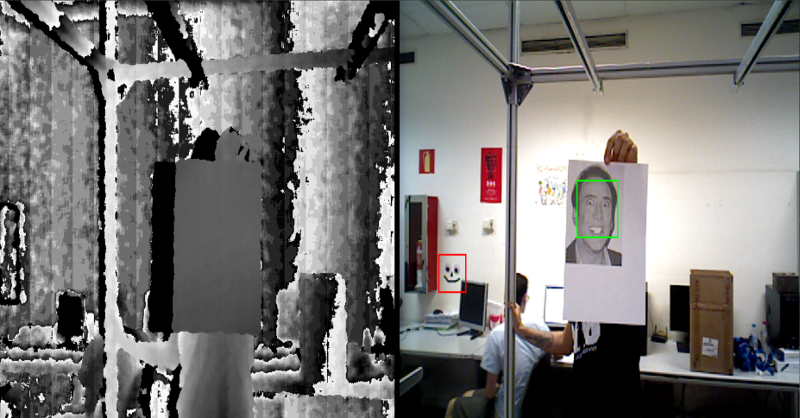
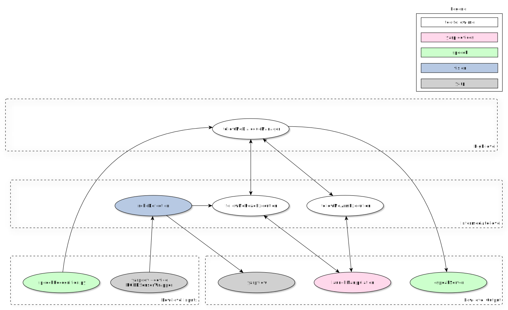
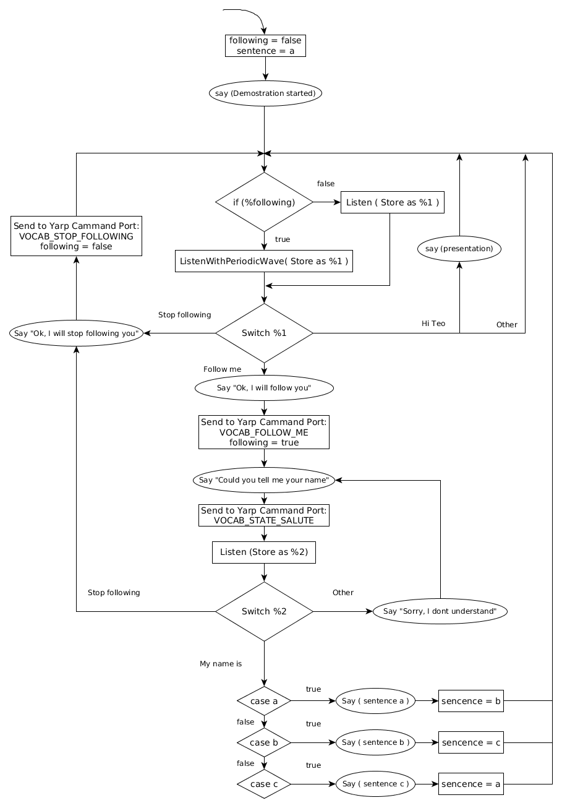

# teo-follow-me

A robotic face following and arm waving demo.

How to run the demo: [Spanish guide](https://robots.uc3m.es/teo-developer-manual/demo-procedure.html)

    

## Installation

Installation instructions for installing from source can be found [here](doc/teo-follow-me-install.md).

## Contributing

#### Posting Issues

1. Read [CONTRIBUTING.md](CONTRIBUTING.md)
2. [Post an issue / Feature request / Specific documentation request](https://github.com/roboticslab-uc3m/teo-follow-me/issues)

#### Fork & Pull Request

1. [Fork the repository](https://github.com/roboticslab-uc3m/teo-follow-me/fork)
2. Create your feature branch (`git checkout -b my-new-feature`) off the `master` branch, following the [Forking Git workflow](https://www.atlassian.com/git/tutorials/comparing-workflows/forking-workflow)
3. Commit your changes
4. Push to the branch (`git push origin my-new-feature`)
5. Create a new Pull Request

## teo-follow-me app program and connection diagram

## teo-Follow-me dialogue manager state machine diagram

## Status

